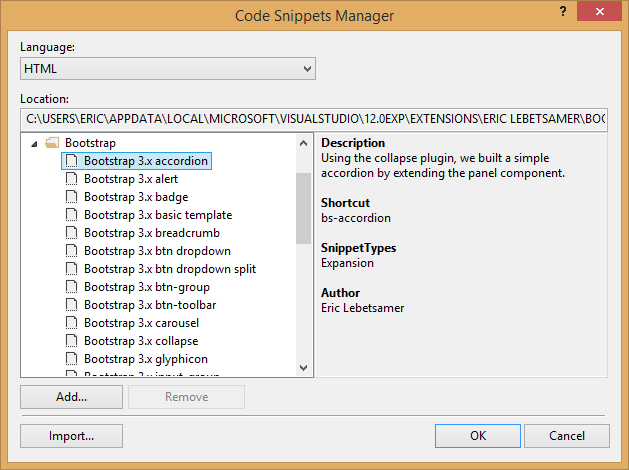

Bootstrap Snippets for Visual Studio
=====================================

##The ultimate snippet pack for web developers using the Twitter Bootstrap framework

Contains a collection of [Twitter Bootstrap](http://getbootstrap.com/) snippets for Visual Studio 2012/2013.

[Download the extension](http://visualstudiogallery.msdn.microsoft.com/e82e7862-f731-4183-a27a-3a44b261bfe5)

[Snippet Listing](https://github.com/elebetsamer/bootstrap-snippets-visual-studio/blob/master/snippet-listing.md)

[Change log](https://github.com/elebetsamer/bootstrap-snippets-visual-studio/blob/master/change-log.md)

  
The "Code Snippets Manager" dialog

##Todo

Automate building of visual studio solution